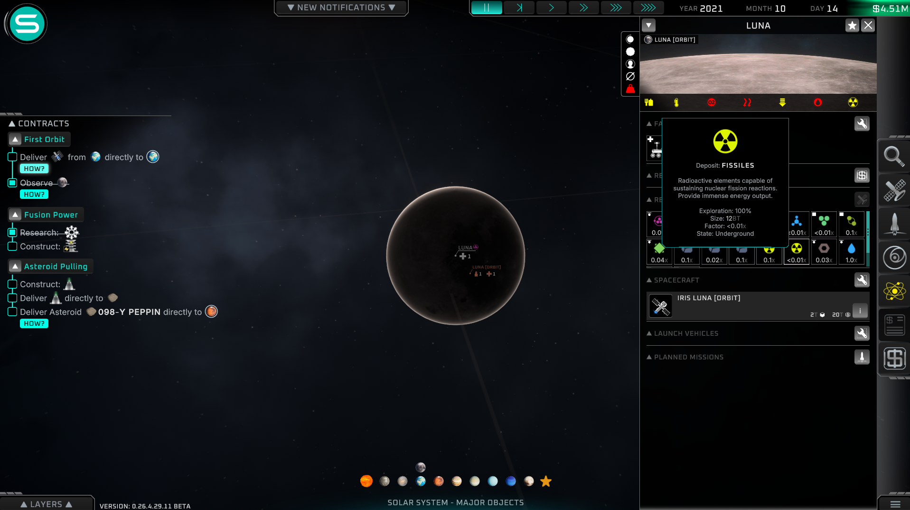

# Solar Expanse Resource Deposits

A small BepInEx mod for [Solar Expanse - Space Exploration Manager](https://store.steampowered.com/app/1369700/Solar_Expanse__Space_Exploration_Manager/) that makes planets, moons, dwarf planets, asteroids, and comets feel less artificially resource-starved over a long campaign.

Solar Expanse is at its best when the Solar System feels like a set of real places worth developing. In the base game, some planetwide bodies can end up feeling oddly restrictive: Luna, for example, can run out of metal or lack basic volatile resources in a way that makes mid- and late-game development feel narrower than it should. This mod adds believable reserve floors for major bodies without removing or reducing any existing deposits.



The goal is not to make every world rich. The goal is to make major worlds viable. Large bodies receive campaign-scale reserves where the resource plausibly exists, while scarcity is represented through low mining factors/frequency rather than tiny hard caps.

## Compatibility

- Game: **Solar Expanse `0.26.4.29.11 BETA`**
- Platform tested: Windows Steam build
- Mod loader: BepInEx 5.x, Unity Mono x64
- Current mod version: `0.1.6`

Solar Expanse is in beta, so game updates may change internal method names or save/runtime structures. This mod intentionally uses runtime hooks and a JSON config to keep the maintenance surface small.

## What It Does

- Adds or tops up missing resource deposits using Solar Expanse's own `ObjectInfo.AddDeposit(...)` path.
- Never removes base-game deposits. Version `0.1.5` can remove oversized unsafe `Gas`/`Liquid` rows created by earlier mod builds.
- Never lowers base values.
- Only adds the missing amount needed to reach a configured floor.
- Applies each configured deposit once per campaign instead of continually replenishing mined resources.
- Gives planets, moons, dwarf planets, and protoplanets very large reserve floors by default.
- Keeps scarce materials slow to mine by using low `miningFactor` values.
- Keeps large reserve floors out of actual atmosphere/ocean state rows by storing added large-body fluid-style resources as underground reserves.
- Trims duplicate configured rows created by older builds that repeatedly re-applied the same deposit rules.
- Loads deposit rules from `BepInEx/config/SolarExpanse.ResourceDeposits.json`.

Examples:

- Luna gets practical long-term reserves for metal, silicon, oxygen, carbon, water, hydrogen, noble gases, nitrogen, helium-3, rare metals, and fissiles.
- Venus and Mars get carbon from their CO2-heavy atmospheres.
- Titan gets nitrogen and carbon-rich hydrocarbon deposits.
- Icy moons get large water/oxygen/hydrogen reserves plus lower-yield volatiles.
- Gas and ice giants get large hydrogen and trace-resource reserves without inflating active atmosphere rows.
- Generic asteroid, comet, dwarf-planet, and protoplanet rules cover bodies that do not have a specific rule.

## Resource Grounding

The config is intentionally conservative about *where* resources are represented. Solar Expanse uses `Gas` and `Liquid` rows as active atmosphere/ocean values, so the mod uses `Underground` rows for added large-body volatile reserves even when the source material would be water ice, CO2 ice, trapped solar-wind volatiles, hydrated minerals, carbon-rich material, or oxygen bound in regolith.

The rule set is guided by public planetary-science references rather than exact ore-body modeling. Useful anchors include NASA's lunar composition summary, NASA/LRO and LCROSS work on lunar polar ice and volatiles, ESA work on extracting oxygen and metal from lunar regolith, NASA's Mars water-ice mapping, NASA Dawn findings for Ceres, and NASA OSIRIS-REx findings that carbonaceous asteroid material can contain water and high carbon.

References:

- [NASA: Moon Composition](https://science.nasa.gov/moon/composition/)
- [NASA: Lunar Ice Deposits Are Widespread](https://science.nasa.gov/solar-system/moon/nasas-lro-lunar-ice-deposits-are-widespread/)
- [NASA: Lunar Volatile Cycles](https://science.nasa.gov/lunar-science/focus-areas/volatile-cycles/)
- [ESA: Oxygen and Metal From Lunar Regolith](https://www.esa.int/ESA_Multimedia/Images/2019/10/Oxygen_and_metal_from_lunar_regolith)
- [NASA: Treasure Map for Water Ice on Mars](https://www.nasa.gov/solar-system/nasas-treasure-map-for-water-ice-on-mars/)
- [NASA: Ceres](https://science.nasa.gov/mission/dawn/science/ceres/)
- [NASA: Bennu Sample Contains Carbon and Water](https://www.nasa.gov/news-release/nasas-bennu-asteroid-sample-contains-carbon-water/)

## Installation

1. Install BepInEx 5 x64 for Unity Mono into the Solar Expanse game folder.
2. Build and deploy the mod:

```powershell
powershell -ExecutionPolicy Bypass -File .\scripts\build.ps1 -Deploy
```

By default the script targets:

```text
C:\Program Files (x86)\Steam\steamapps\common\Solar Expanse
```

Use `-GameDir` if your Steam library is somewhere else:

```powershell
powershell -ExecutionPolicy Bypass -File .\scripts\build.ps1 -Deploy -GameDir "D:\SteamLibrary\steamapps\common\Solar Expanse"
```

The deployed files are:

```text
BepInEx\plugins\SolarExpanse.ResourceDeposits\SolarExpanse.ResourceDeposits.dll
BepInEx\config\SolarExpanse.ResourceDeposits.json
```

Restart the game after deploying. The mod applies after the solar-system objects load.
After first application, the mod records campaign/object/resource keys in `BepInEx\config\SolarExpanse.ResourceDeposits.applied.json` so it does not keep adding nodes as months pass.

## Configuration

Edit:

```text
BepInEx\config\SolarExpanse.ResourceDeposits.json
```

Important fields:

- `enabled`: turn the mod on or off.
- `onlyAddToMineableObjects`: skip objects the game marks as non-mineable.
- `applyOncePerCampaign`: record each applied object/resource/state so the mod does not replenish it later.
- `continuousRescan`: keep the old recurring scan behavior. Defaults to `false`.
- `scanIntervalSeconds`: retry interval for runtime application.
- `minimumAddAmount`: smallest missing amount worth creating as a deposit row.
- `largeBodyReserveMultiplier`: multiplier applied to planets, moons, dwarf planets, and protoplanets.
- `largeBodyObjectTypes`: object types that receive the large-body multiplier.
- `largeBodyReserveMultiplierExcludedStates`: effective states that do not receive the large-body multiplier. Defaults to `Gas` and `Liquid`.
- `remapLargeBodyFluidDepositsToUnderground`: stores added large-body gas/liquid resources as underground reserves instead of changing active atmosphere/ocean mass.
- `cleanupLegacyUnsafeFluidDeposits`: removes oversized gas/liquid rows created by older mod versions.
- `cleanupDuplicateConfiguredDeposits`: trims duplicate configured deposit rows created by older repeated scans.
- `rules`: target matchers and deposit specs.

Each deposit has:

- `resourceId`: Solar Expanse internal resource id.
- `minimumAmount`: reserve floor before large-body multiplier.
- `miningFactor`: mining richness/frequency.
- `state`: `Solid`, `Liquid`, `Gas`, or `Underground`.
- `fullyExplored`: whether the deposit appears immediately.
- `forcePrimary`: whether to force it as the primary deposit.
- `reason`: human-readable rationale.

## Build

Requirements:

- .NET SDK 8 or newer
- Solar Expanse installed locally
- BepInEx installed in the target game folder before building, because the project references `BepInEx.dll` and Unity assemblies from the game directory

Build only:

```powershell
dotnet build .\src\SolarExpanse.ResourceDeposits\SolarExpanse.ResourceDeposits.csproj -c Release
```

Build and deploy:

```powershell
powershell -ExecutionPolicy Bypass -File .\scripts\build.ps1 -Deploy
```

## Troubleshooting

Check:

```text
Solar Expanse\BepInEx\LogOutput.log
```

A healthy load should include:

```text
Loading [Solar Expanse Resource Deposits 0.1.6]
Installed 5 lifecycle hook(s) for resource deposit application.
```

Version `0.1.6` or newer is recommended. Earlier versions could repeatedly top up configured resources over time. Versions before `0.1.5` could also create oversized `Gas` or `Liquid` rows on major bodies, which may affect habitability because the game treats those rows as actual atmosphere or ocean mass.

If deposits are not visible:

- Confirm the game has been restarted after deploying.
- Confirm `enabled` is `true`.
- Confirm BepInEx is loading the plugin.
- Load into an actual solar-system save, then wait a few seconds.
- Check the log for scan/add messages or explicit apply errors.

## License

MIT. See [LICENSE](LICENSE).
